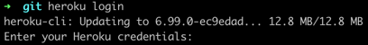

# How to start app at local env

1. Build with command `./gradlew clean build` to create new build
2. Execute `docker-compose up --build --force-recreate` to start your app

# Deploy to heroku

1. https://devcenter.heroku.com/articles/deploying-spring-boot-apps-to-heroku
2. Download heroku cli
3. Execute cmd `heroku login`
    1. 
4. Go to project folder. Example: cd crypto-history
    1. 
5. Execute cmd `heroku create`
    1. 
6. Execute cmd
    1. `git add . && git commit -m "Added system.properties with target jvm version"` to commit your code
    2. `git push --set-upstream heroku master` to deploy your app
7. Execute cmd `heroku open` to open you app
    1. 
8. Execute cmd `heroku log --tail` to view log
    1. 
9. Test your API
   with `curl --location --request POST 'https://murmuring-springs-40070.herokuapp.com/api/search-crypto-history' \
   --header 'X-CMC_PRO_API_KEY: b54bcf4d-1bca-4e8e-9a24-22ff2c3d462c' \
   --header 'Accept: application/json' \
   --header 'Content-Type: application/json' \
   --data-raw '{
   "startTime" : "2019-10-05T13:00:00+00:00",
   "endTime" : "2021-10-05T15:00:00+00:00"
   }'`
    1. 